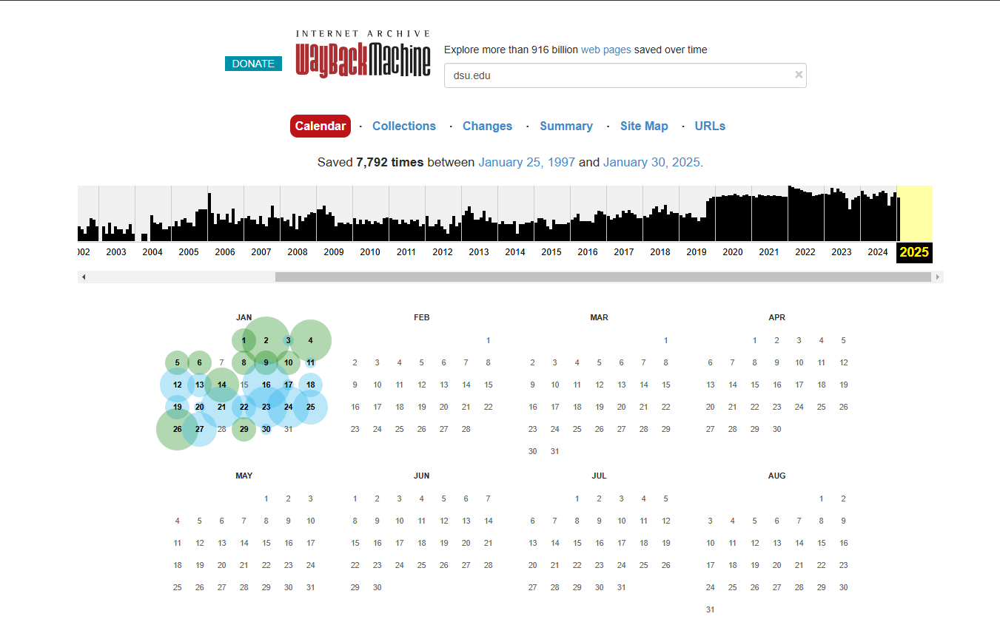
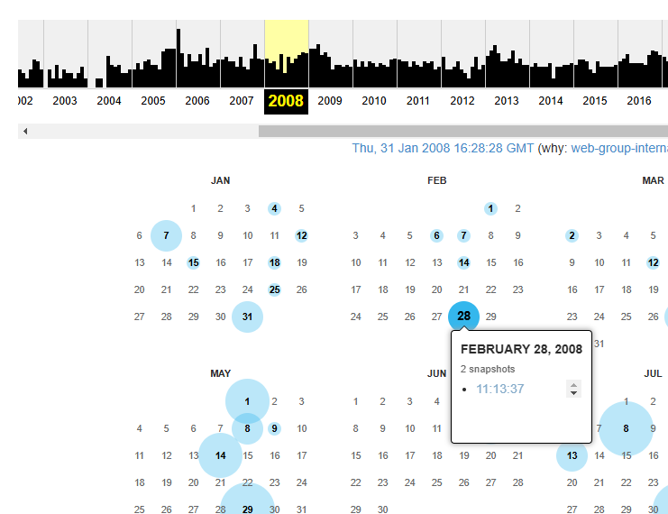
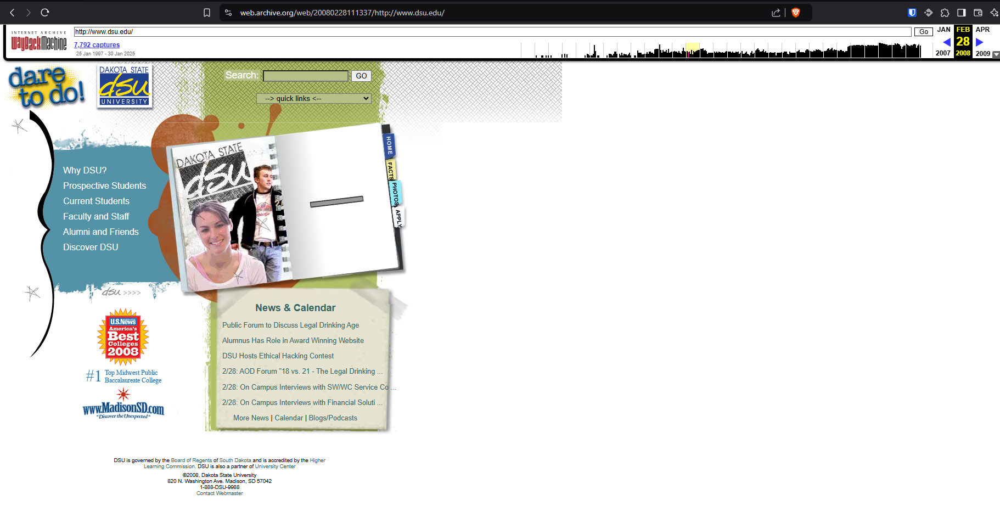

# Wayback Machine I

The internet is a great place to find information on basically anything. That also makes it scary.

You know how people say, "if it's on the internet, it's forever." Whether that's true or not is up for debate, but we should treat it as if it is true, because functionally it is. Tools like `The Wayback Machine` at `web.archive.org` have made it their goal to `archive` the entire internet. This is done imperfectly and doesn't preserve every website at every moment of history, but they have archived over 916 billion web pages, spanning decades, since the project started. 

Tools like the Wayback Machine are useful to us when we are trying to find certain information that may not necesarrily exist on a website anymore. For example, maybe you want to reread a blog post from an old website that has since been changed. If that old site was archived by the Wayback Machine you can look up the URL, and select the proper year and month, and actually view that blog post from that point in time (assuming it was archived). 

The Wayback Machine has sites archived from 1996 all the way up to our current day. This means there exists a wide breadth of data for us to potentially find information we need.

# How To Use

## First, browse to web.archive.org.

You will find a page that looks like this:

## Second, enter a website URL into the search.

This is what the result page will look like (notice you can select a year at the top):

## Third, select a year, month, and a day.

When you hover your mouse over a dot, it'll display the time of day that the site was archived:

## Fourth, click the time in the selection.

It will take you to the archived website from that year, day, and time.

Now you can see what `dsu.edu` looked like on February 28th, 2008! Not only that, but you can browse it as normal and the pages should display (if they are archived)!

Here is what happens if you click on the `Why DSU?` link:

This is what it would've been like to browse this site in 2008.

# Conclusion

You can see that the Wayback Machine is a powerful tool that can be used for many purposes when performing OSINT. In this challenge, you will be asked to use the Wayback Machine to locate information from a website that no longer exists on it today!

Start the challenge and then run `/challenge/run` to get your challenge! You will need to use your own local browser to access the Wayback Machine!

Once you find the information required, run `verify` and it will ask for your answer! Submit it, and get the flag!